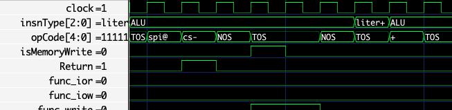

# SIMULATOR

This directory  contains a verilator-based simulator for the Hana 1
soft core Forth stack machine. It runs on Mac OS Apple hardware, and
x86 Linux.  

To run the emulator type

./emulate

It will then call

./compile

The escape key can be used to leave the simulator, but preserve the
trace functionality.

To run the tests type 

./runtests

The interface on runtests needs to be improved. 

Compiling is a three stage process.  First gforth is used to compile a
nucleus.  The nucleus is enough to boot the system.  Then the
remaining code is loaded into the simple simulator, and exported to
build/iceimage.hex. The data is copied to the flash image. Then the
flash simulator can be run.  When you run the simulator it has two arguments.

-halt will halt on overflow or underflow.  This should be used during
development, but now when running the test suite.

-trace will run the tracing.   It creates a file signal.fst which can then
be viewed by typing

gtkwave signal.gtkw

Inside gtkwave, the following signals are available.
::

    instructionType see James Bowman's paper for the values. 
    literal  For 16 bit literals, it is the inverse of the value. 
    opCode   see instructionset.fs for values. 
    return   from call.
    dspI     delta for the stack pointer. 
    rspI     delta for the return stack pointer. 
    jumpAddress  for calls, jumps and conditional jumps. 

In GTKWave you can control how they are displayed.
In the second column, select the signal, right click on

Data Format->Translation Filter File -> Enable and Connect
Then add filter to list.  Click into
gtkwave-filters, and select the filter you want to use.
There are currently filters for instruction type and alu opcode.
Sadly you have to select these files yourself, gtkwave uses the full path name
to the file, which will be different from the one on my computer.
